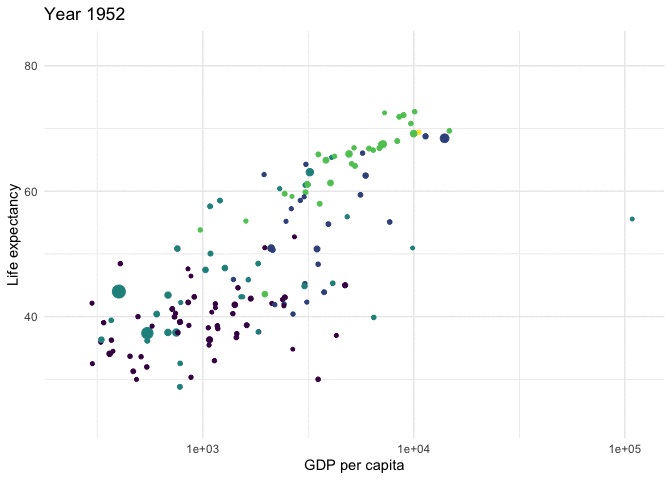
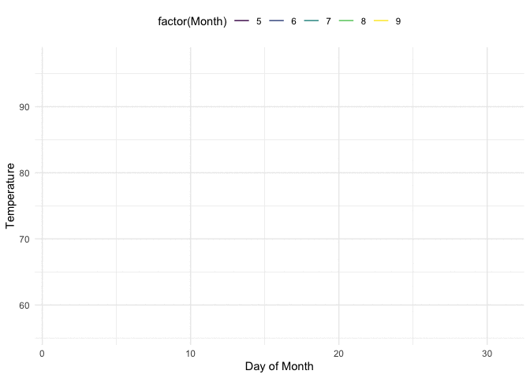

```{r message=F, results=F, warning=F}
library(tidyverse)
```


# Intro to Animation

Check out these animations: 

{width=70%}

{width=70%}


Animations can create valuable insights, especially for changes over time. 

There are lots of packages available to animate graphs in R: 

- `animate`- can be used to animate any plot type, written by Yihui Xie
- `gganimate`- used to specifically animate ggplot graphics, written by Thomas Lin Pedersen
- `plotly` -  an interactive plotting library which has animation features
- `googlevis` - has a flash based motion chart option

# `gganimate`

## Gapminder
 
Recall the gapminder dataset: 

```{r}
library(ggplot2)
theme_set(theme_minimal())
library(gapminder)
head(gapminder)
```

Let's start with a static (regular) plot of log(gdp per capita) vs. Life Expectancy in the year 1967. 

```{r}
gapminder %>% 
  filter(year == 1967) %>% 
  ggplot(aes(x = gdpPercap, 
             y=lifeExp, 
             size = pop)) +
  geom_point(show.legend = F, aes(color=continent)) +
  scale_color_viridis_d() + 
  scale_x_log10() +
  labs(x = "GDP per capita", y = "Life expectancy")
```

Wouldn't it be cool if we could animate this over time? Yes! 

```{r}
library(gganimate)
```

```{r}
p<-gapminder %>% 
#  filter(year == 1967) %>% now we want all years included
  ggplot(aes(x = gdpPercap, 
             y=lifeExp, 
             size = pop)) +
  geom_point(show.legend = F, aes(color=continent)) +
  scale_color_viridis_d() + 
  scale_x_log10() +
  labs(x = "GDP per capita", y = "Life expectancy") + 
# here we add animation stuff
  transition_time(year) +  
  labs(title = "Year {frame_time}")
```

```{r}
#animate(p, fps=1)
```


You may want to save your plot for use other places... 

```{r}
anim_save("gapminder.gif", animation=p )
```



## Customizing Transitions

`ease_aes()` is used to "control easing of aesthetics". It how to points will transition from one frame to the next. Some of the options are: 

- linear (default)
- quadric
- cubic 
- sine
- circular
- exponential
- back
- bounce

modifiers include:

- **-in**
- **-out** 
- **-in-out**

For example:
```{r}
#p + ease_aes("bounce-in")
```


## Air quality data

`airquality` measures daily air quality measurements in New York, May to September 1973

```{r}
head(airquality)
```


Let's consider another static plot: 

```{r}
ggplot(
  airquality,
  aes(Day, Temp, group = Month, color = factor(Month))) +
  geom_line() +
  scale_color_viridis_d() +
  labs(x = "Day of Month", y = "Temperature") +
  theme(legend.position = "top")
```

Maybe we want to data to gradually appear...

```{r}
p<- airquality %>% 
  ggplot(aes(Day, Temp, group = Month, color = factor(Month))) +
  geom_line() +
  scale_color_viridis_d() +
  labs(x = "Day of Month", y = "Temperature") +
  theme(legend.position = "top") + 
  ## ADD THIS CODE TO ANIMATE
  transition_reveal(Day)
```


```{r}
anim_save("airquality.gif", animation=p )
```



## More Examples

Check out this link for some animated barplots: [https://towardsdatascience.com/create-animated-bar-charts-using-r-31d09e5841da](https://towardsdatascience.com/create-animated-bar-charts-using-r-31d09e5841da)

Using `gganimate` and maps example: [https://d4tagirl.com/2017/05/how-to-plot-animated-maps-with-gganimate](https://d4tagirl.com/2017/05/how-to-plot-animated-maps-with-gganimate)

Using `gganimate` to animate Speed Dating Data Example: [https://www.statworx.com/ch/blog/animated-plots-using-ggplot-and-gganimate/](https://www.statworx.com/ch/blog/animated-plots-using-ggplot-and-gganimate/)

A guide to types of transitions: [https://gganimate.com/articles/gganimate.html](https://gganimate.com/articles/gganimate.html)

A full guide to `gganimate` and all the possible options is available here: [https://cran.r-project.org/web/packages/gganimate/gganimate.pdf](https://cran.r-project.org/web/packages/gganimate/gganimate.pdf)

# `plotly` and `ggplotly`


```{r message=F, warning=F, results=F}
library(plotly)
```

```{r}
data(gapminder, package = "gapminder")

gg <- ggplot(gapminder, 
          aes(gdpPercap, lifeExp, color = continent)) +
      geom_point(aes(size = pop, frame = year, ids = country)) +
    scale_x_log10()

ggplotly(gg)
```

You can learn more about plotly and all it's features here: [https://plotly-r.com/index.html](https://plotly-r.com/index.html)
